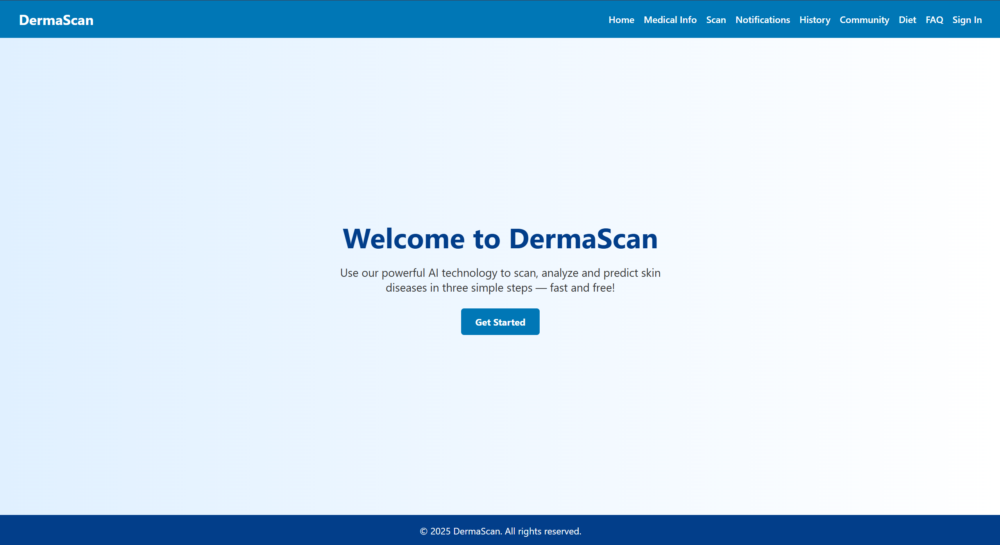
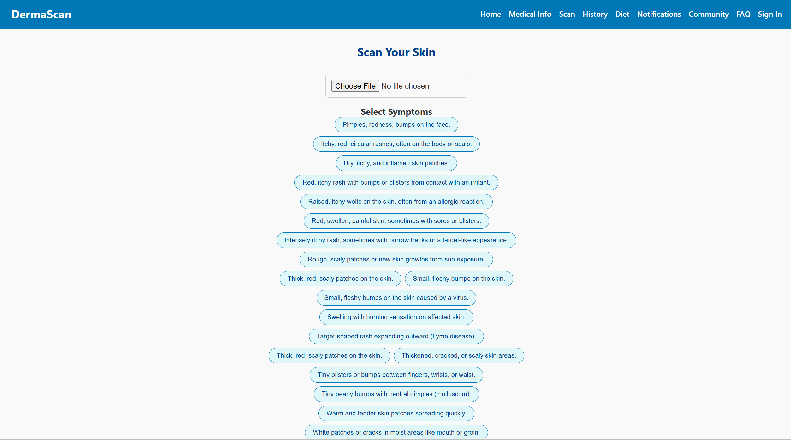
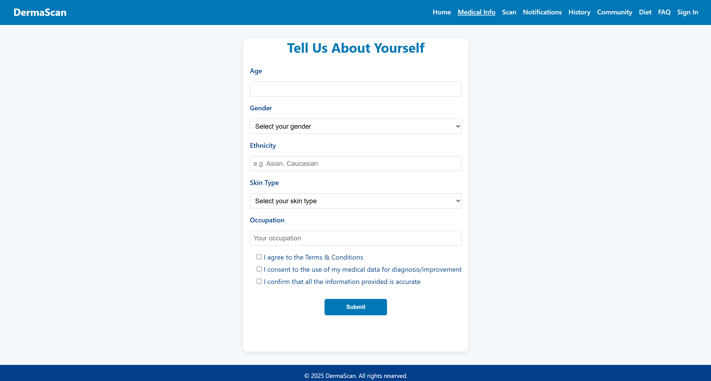
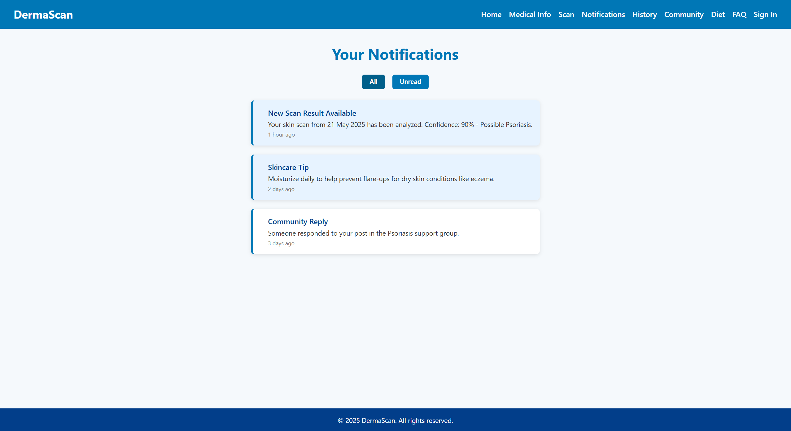
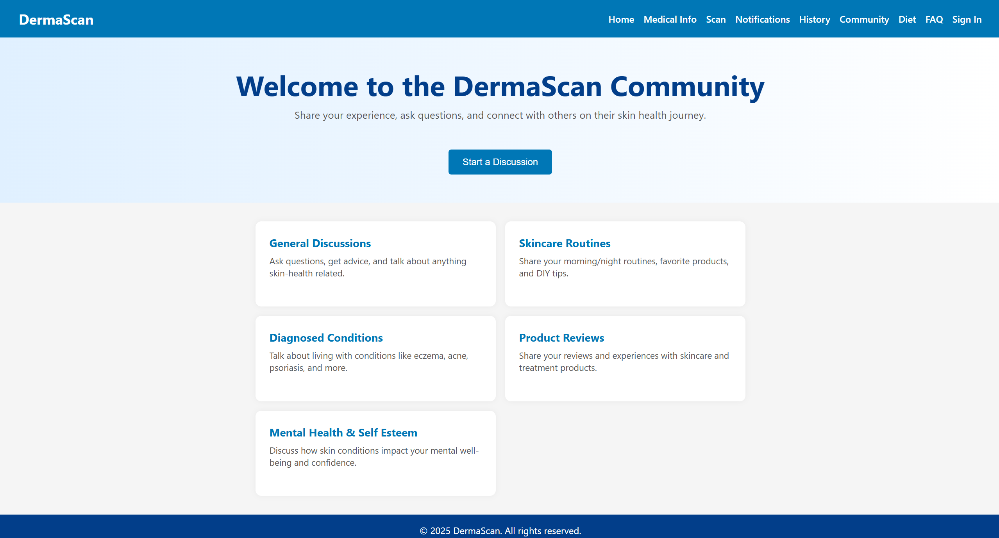
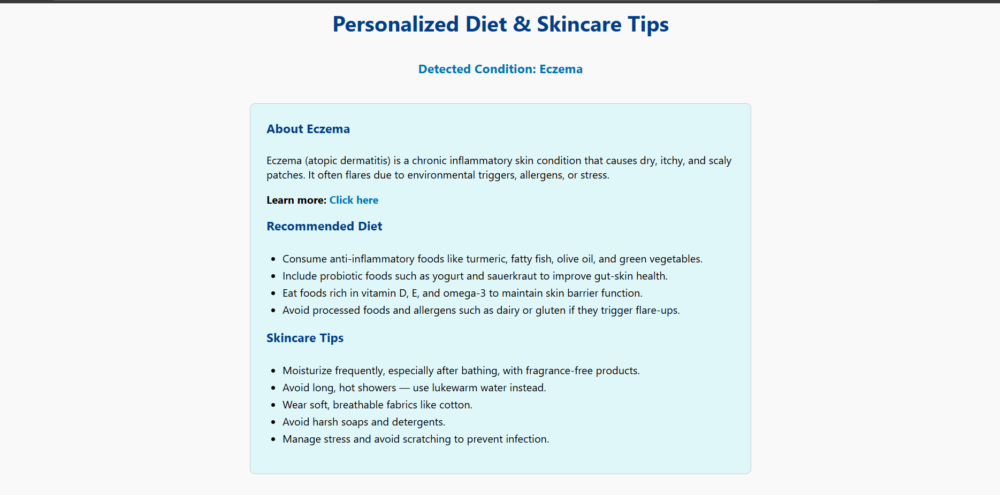
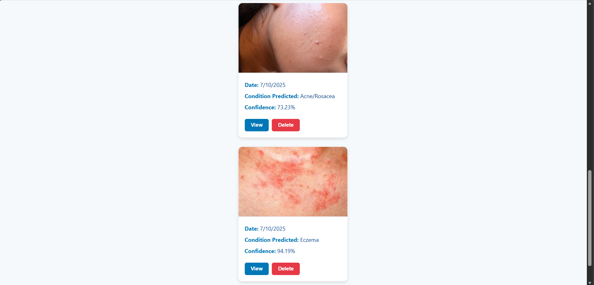

# DermaScan 🧴🔬  
AI-Based Skin Disease Detection System

DermaScan is a full-stack AI-powered web application designed to assist in the early detection of skin diseases using deep learning techniques. Users can upload skin images, which are analyzed by trained neural network models to provide predictive insights and relevant information.

##  Features

- AI-based skin disease detection
- Image upload and analysis
- User-friendly web interface
- Informational pages (Diet, FAQ, History, Community)
- Backend API handling
- Deep learning model integration

##  Output Screenshots

###  Home / Landing Page

  

###  Scan Page

  

###  Medical Information Page

  

###  Notifications Page

  

###  Community Page

  

###  Diet Recommendation Page

  

###  History Page

  

###  Scan Result Page

  

